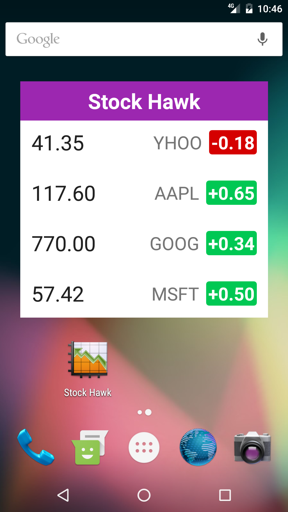

# StockHawk
[Google Android Nanodegree](https://www.udacity.com/course/android-developer-nanodegree-by-google--nd801) Project 3.

# Objective: 
To productionize an app, taking it from a functional state to a production-ready state. 
This will involve finding and handling error cases, adding accessibility features, allowing for localization, adding a widget, and adding libraries.

# Learning Outcomes
* Diagnosing existing issues with an app
* Making an app accessible to sight-impaired users
* Allowing app to be localized for distribution in other countries
* Handling error cases in Android
* Adding widgets to enhance user experience

# [Screenshots](https://github.com/GurpreetSK95/StockHawk/tree/master/Screenshots)

  
  
  
  

